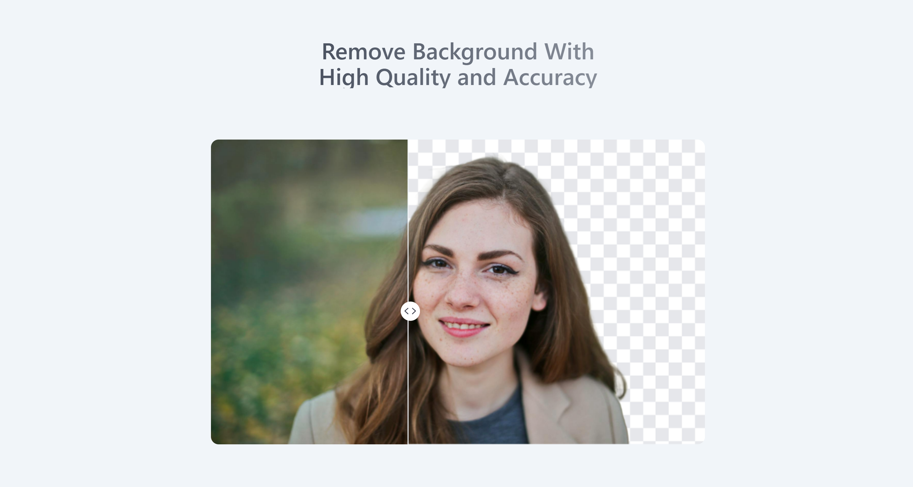
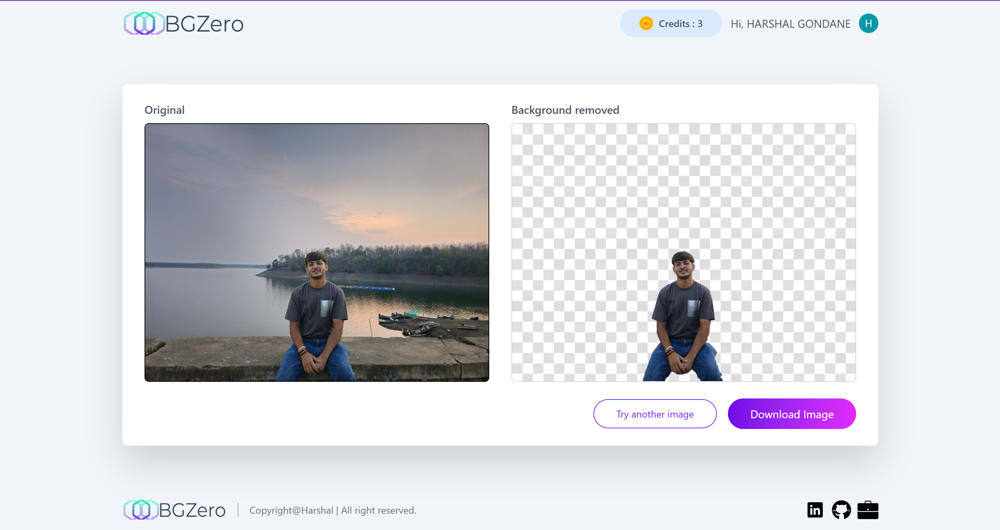
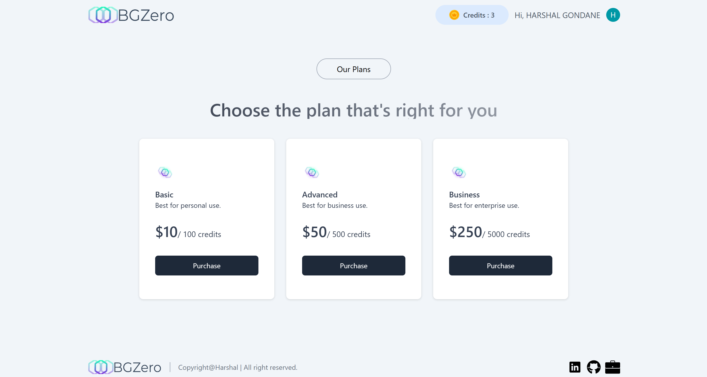
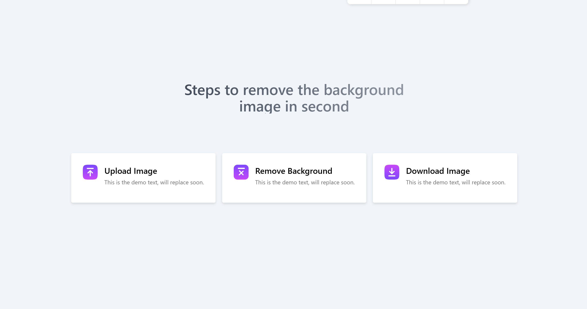

# BGZero – AI Powered Background Removal App 🖼️✨

🚀 **Live Demo:** [bg-zero.vercel.app](https://bg-zero.vercel.app/)  
📦 **GitHub Repo:** [BGZero--AI-BG-Removal](https://github.com/harshalgondane33/BGZero--AI-BG-Removal)

BGZero is a modern full-stack AI-powered application that removes image backgrounds with just one click. Users can log in securely, upload images, and purchase credits to process multiple files using Razorpay integration.

---

## 🔑 Features

- 🧠 **AI-Powered Background Removal** using ClipDrop API  
- 🔐 **Authentication** with Clerk (Sign up, Login, Logout, Session Handling)  
- 💳 **Credits & Payments** handled securely via Razorpay  
- 📊 **User Dashboard** showing remaining credits and processed images  
- 🌐 **Fully Deployed on Vercel** for instant global access  

---

## 🛠️ Tech Stack

| Layer           | Technology              |
|----------------|--------------------------|
| Frontend       | React.js, Tailwind CSS   |
| Backend        | Node.js, Express.js      |
| Database       | MongoDB (Mongoose)       |
| Authentication | Clerk                    |
| Payments       | Razorpay                 |
| AI Service     | ClipDrop API             |
| Deployment     | Vercel                   |

---

## 🧪 Local Setup

> Make sure you have **Node.js**, **npm**, and **MongoDB** installed.

1. **Clone the repository**
   ```bash
   git clone https://github.com/harshalgondane33/BGZero--AI-BG-Removal.git
   cd BGZero--AI-BG-Removal
   ```

2. **Setup the Backend**
   ```bash
   cd server
   npm install
   ```

3. **Setup the Frontend**
   ```bash
   cd ../client
   npm install
   ```

4. **Configure Environment Variables**

   Create `.env` files in both `server` and `client` directories with the following keys:

   **Server (.env):**
   ```
   MONGODB_URI=your_mongo_uri
   CLERK_SECRET_KEY=your_clerk_secret_key
   RAZORPAY_KEY_ID=your_razorpay_key_id
   RAZORPAY_KEY_SECRET=your_razorpay_key_secret
   CLIPDROP_API_KEY=your_clipdrop_api_key
   ```

   **Client (.env):**
   ```
   VITE_CLERK_PUBLISHABLE_KEY=your_clerk_publishable_key
   VITE_API_URL=http://localhost:8080
   ```

5. **Run the App**

   - Start backend:
     ```bash
     cd server
     npm start
     ```

   - Start frontend:
     ```bash
     cd ../client
     npm run dev
     ```

6. **Visit Local App**
   ```
   http://localhost:5173
   ```

---

## 📸 Screenshots

<div align="center">

  
  
  
  <br/>
  
  
</div>

---

## 🧾 License

This project is licensed under the **MIT License**.  
See the [LICENSE](LICENSE) file for more details.

---

## 🤝 Contributing

Contributions, issues, and feature requests are welcome!  
Feel free to [open an issue](https://github.com/harshalgondane33/BGZero--AI-BG-Removal/issues) or submit a pull request.

---

## 🙋‍♂️ Author

Developed by [**Harshal Gondane**](https://github.com/harshalgondane33)

---

> 💡 _If you found this project helpful, don’t forget to ⭐ the repo!_